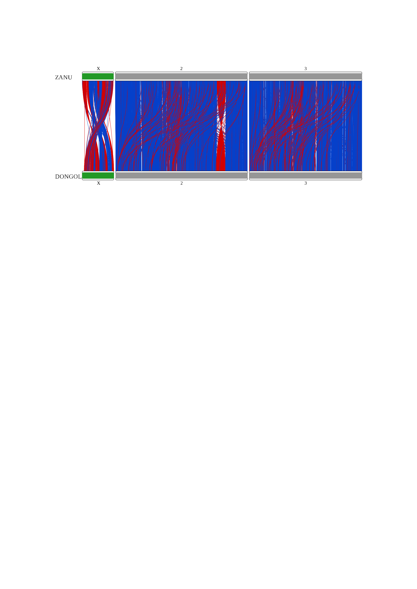

```{r}
#install.packages("rsvg")
#install.packages("RIdeogram")
```
```{r}
library("RIdeogram")
library("dplyr")
library("tidyr")
```

```{r}
dongola <- read.csv("DONGOLA_genes.tsv", sep='\t')
zanu<- read.csv("ZANU_genes.tsv", sep='\t')
gene_map <- read.csv("gene_mapping.tsv", sep='\t')

head(dongola)
head(zanu)
head(gene_map)
```

```{r}
chr = c('2','3','X')
gene_map <- gene_map[gene_map$contig %in% chr,]

gene_map <- separate(data=gene_map, col=DONG, into=c("dong_id", "dong_mid", 'dong_strand', 'dong_len', 'dong_name'), sep=",")

gene_id_map = data.frame(id=c('2',"3","X"), val=c('NC_053517.1', 'NC_053518.1', 'NC_053519.1'))
gene_map$dong_id <- with(gene_id_map, id[match(gene_map$dong_id, val)])
head(gene_map)
```

```{r}
gene_map <- gene_map[gene_map$dong_id %in% chr,]

gene_map$dong_name <- as.character(lapply(gene_map$dong_name, gsub, pattern = '^DONG_', replacement =""))
gene_map$distance <- abs(gene_map$middle.pos - as.numeric(gene_map$dong_mid))
```

```{r}
karyotype_zanu <- data.frame(
  c('X', 2, 3),
  c(1, 1, 1),
  c(27238055, 114783175, 97973315),
  c(229926, 969696, 969696),
  c('ZANU', 'ZANU', 'ZANU'),
  c(12, 12, 12),
  c(252525, 252525, 252525))
colnames(karyotype_zanu) <- c('Chr','Start','End','fill','species','size','color')

karyotype_dongola <- data.frame(
  c('X', 2, 3),
  c(1, 1, 1),
  c(26913133, 111988354, 95710210),
  c(229926, 969696, 969696),
  c('DONGOLA', 'DONGOLA', 'DONGOLA'),
  c(12, 12, 12),
  c(252525, 252525, 252525))
colnames(karyotype_dongola) <- c('Chr','Start','End','fill','species','size','color')

karyotype_table <- rbind(karyotype_zanu, karyotype_dongola)
head(karyotype_table)
```

```{r}
dong_2_end = 111988354
dong_3_end = 95710210 
dong_X_end = 26913133 
```

```{r}
gene_map$contig[gene_map$contig == "X"] <- 1
gene_map$dong_id[gene_map$dong_id == "X"] <- 1

blue = "0540ca"
red = "d40000"

start_z <- c()
end_z <- c()
fill <- c()
for (i in (1:nrow(gene_map))){
    name <- gene_map[i, "name"]
    fill <- if (gene_map[i, "strand"] == gene_map[i, "dong_strand"]) append(fill, red) 
    else append(fill, blue)
    start_z <- append(start_z, zanu[zanu$ID == name, "start"])
    end_z <- append(end_z, zanu[zanu$ID == name, "end"])
}
```

```{r}
start_d <- c()
end_d <- c()
for (i in (1:nrow(gene_map))){
    name <- gene_map[i, "dong_name"]
    if (gene_map[i, "contig"] == 1){
    start <- dong_X_end - dongola[dongola$ID == name, "start"]
    end <- dong_X_end - dongola[dongola$ID == name, "end"]
    } else if ((gene_map[i, "contig"] == 2)){
      start <- dong_2_end - dongola[dongola$ID == name, "start"]
      end <- dong_2_end - dongola[dongola$ID == name, "end"]
    } else {
      start <- dong_3_end - dongola[dongola$ID == name, "start"]
      end <- dong_3_end - dongola[dongola$ID == name, "end"]
    }
  start_d <- append(start_d, start)
  end_d <- append(end_d, end)
}
```


```{r}
synteny_table <- data.frame(Species_1 = as.numeric(gene_map$contig),
                            Start_1 = start_z, 
                            End_1 = end_z, 
                            Species_2 = as.numeric(gene_map$dong_id),
                            Start_2 = start_d,
                            End_2 = end_d,
                            fill = fill)

synteny_table <- synteny_table[synteny_table$Species_1==synteny_table$Species_2, ]
head(synteny_table)
```

```{r}
ideogram(karyotype = karyotype_table, synteny = synteny_table)
convertSVG("chromosome.svg", device = "png")
```

